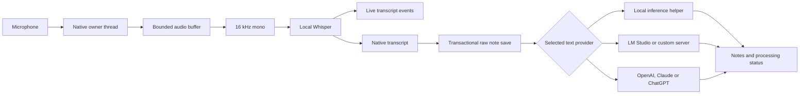

# Architecture

## Runtime boundary

The React workspace uses one `Backend` interface. Browser mode is an in-memory sample workspace; it cannot record audio or save credentials. Tauri mode invokes the Rust core. An empty or failing desktop library never falls back to samples. List queries load up to 1,000 recent meetings and 5,000 actions; selecting a meeting loads its transcript separately. Search uses a debounced, cancellable result lifecycle.

The production webview loads bundled assets under an IPC-only connection policy and receives event subscription permissions. There is no generic HTTP, shell or filesystem plugin exposed to the renderer. Native commands validate input and own provider traffic. Networking is permitted in native code: this is not a process-wide air gap.

## Capture and persistence

Capture startup loads Whisper and validates microphone access before reporting success. A gate serializes capture startup, stop, cancel and destructive operations. The audio stream stays on its owner thread. Stop drains buffered input, joins the worker and persists the authoritative native transcript with its timestamps. The frontend is not the storage source.

System loopback and speaker identification are not implemented. All current transcript segments belong to one unidentified microphone source. Device changes, complete call capture and platform-specific recording behavior need real-hardware validation.

The raw note is committed before summary inference. Failure afterward leaves it available. If the initial database save fails, pending capture stays in native memory for retry or discard; that memory does not survive process exit or power loss. Audio is not intentionally written to disk.

## Text providers

`providers.rs` owns non-secret provider configuration, API-key storage and transport. The `Completion` interface lets the note-generation layer use built-in inference, LM Studio, an OpenAI-compatible server, the OpenAI API, the Anthropic API or the separate ChatGPT sign-in transport. The same selected provider also serves library questions, recipes and commitment extraction.

Provider selection is explicit. Off-device routes require consent. Remote endpoints require HTTPS; LM Studio uses a literal loopback HTTP address. The client disables redirects and automatic proxy discovery, uses timeouts and response-size bounds, and validates completion shape/finish status. Local inference does not fail over to a cloud service. Compatibility with a custom endpoint still needs a real test.

The connection test sends a synthetic text prompt to the saved summary configuration. It verifies that route only; it is not an end-to-end recording test or a guarantee that a long transcript fits the model context.

Meeting processing details record the requested provider/model, configured destination and summary outcome for that meeting. They do not independently verify a server’s actual model or forwarding behavior. A saved summary can be retried against its stored transcript without recapture. Regeneration preserves existing action IDs and completion state. The processing record describes app behavior; it does not prove the truth of generated text or an external provider's handling of it.

## Local inference

Whisper runs in the application process. `llama.cpp` runs in an adjacent helper executable to avoid native GGML symbol collisions. Private stdin/stdout pipes carry bounded newline-delimited JSON. Requests have a 180-second deadline; timeout or invalid transport output kills and reaps the worker. The app invokes a fixed helper path without a shell or PATH lookup.

Whisper and the built-in Qwen model read manually installed files under `library/models/`. CPU inference is the default; Metal/CUDA are explicit opt-ins. The helper uses the model's chat template, bounded context and generation, batched evaluation and explicit sampling. Structured note output is parsed before persistence. Context-limit failures surface errors rather than silently dropping part of the input.

Library questions retrieve FTS passages, optionally scoped to one meeting. This is keyword retrieval. Vector embeddings, semantic retrieval and calendar integration are not implemented.

## ChatGPT authentication

`auth.rs` implements the official open-source/local-app flow: browser authorization, a random-port loopback callback, PKCE/state/nonce checks, ID-token verification, registered account metadata, credential refresh and disconnect. Secrets remain in native memory or the OS credential store. The renderer receives account labels and connection status.

An exclusive library lock permits one native app instance per library, preventing competing refreshes of rotating tokens. The settings screen can fetch the active account’s model catalog on request.

The ChatGPT plan route uses eligible text Responses requests. It does not retrieve existing ChatGPT conversations or transcribe audio. Its eligibility and limits differ from an API-key route. Real-account end-to-end validation is pending; see the [official overview](https://developers.openai.com/siwc/token-sharing-open-source) and [preview limits](https://developers.openai.com/siwc/token-sharing-open-source/preview-limitations).

## Storage and deletion

SQLite stores meetings, segments, actions, commitments, recipes, processing metadata and settings. Foreign keys are enabled. FTS5 triggers track segment inserts, edits and deletes. Migration repairs historical orphan rows and rebuilds the index. Multi-row imports and note saves are transactional.

Retention applies to future inserts and existing meetings. Expiry is enforced on startup and periodically while running. Deletion removes dependent content, rebuilds FTS, compacts the database and checks WAL truncation. Purge retains the schema and model files. Provider configuration and credentials live outside the database and are managed separately.

The database is not encrypted by the app. OS backups, snapshots and provider-held requests are beyond a local purge's control.

## Delivery and verification

Static regression checks cover the webview policy, capability grants, signing entitlements and the native modules allowed to contain provider networking. They are not a proof of network isolation. Native tests cover storage, capture utilities, transport parsing and related control flow; mocked providers do not establish external account compatibility.

A release needs real microphone/model sessions, provider/account tests, install/upgrade checks and platform-specific packaging QA. macOS signing must preserve the helper's sandbox-inheritance entitlements. Those entitlements now inherit an app that permits provider networking; they do not make the helper air-gapped.

See [Privacy](../PRIVACY.md), [Security](../SECURITY.md) and the [competitive priorities](COMPETITIVE_RESEARCH.md).
