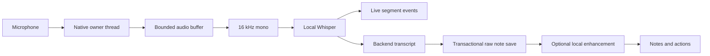

# Architecture

## Runtime boundary

The React workspace uses one `Backend` interface. Browser mode is an in-memory sample workspace. Tauri mode invokes the Rust core; an empty or failing desktop library never falls back to samples. List queries load up to 1,000 recent meetings and 5,000 action items; selecting a meeting loads that transcript separately. Search uses a debounced, cancellable result lifecycle.

The production webview loads bundled assets under a restrictive CSP and receives only the event subscription permissions it needs. Custom IPC commands validate inputs. There is no shell, filesystem plugin or HTTP plugin exposed to the renderer. The framework and OS webview still contain networking functionality; the application does not claim otherwise.

## Capture and persistence

Capture startup loads the model and validates microphone access before reporting success. A capture gate serializes startup, stop, cancel and destructive data operations. The audio stream stays on its owner thread. Stop joins the worker after draining buffered input, preserves actual timestamps, and persists the native transcript. The frontend never reconstructs timing from line positions.

Raw notes are saved before LLM inference. A missing model or invalid response leaves the transcript intact. If persistence fails, the pending capture remains in native memory for retry; the UI offers retry or explicit discard. This does not survive process exit or power loss. Raw audio is not intentionally written to disk, but RAM disposal is not a cryptographic erasure guarantee.

## Inference

Whisper runs in the application process; llama.cpp runs in a persistent adjacent helper executable. The helper uses bounded newline-delimited JSON through private stdin/stdout pipes, with a 180-second timeout and kill/wait cleanup on failure. No shell or socket is used. The helper inherits the macOS application network sandbox; its standalone executable does not claim OS isolation. Signed macOS packaging must preserve its sandbox-inheritance entitlements.

Whisper and llama.cpp read model files installed manually under the app's `library/models` directory. CPU inference is the default; Metal/CUDA are explicit feature flags. LLM prompts use the model's chat template, bounded context and generation, batched evaluation and explicit sampling. Structured output is parsed and validated before it enters the database.

Library questions retrieve matching FTS passages, optionally scoped to one meeting. This is lexical retrieval. Semantic embeddings, diarization and system audio capture are planned, not implemented. Context limits produce actionable errors rather than silent transcript truncation.

## Storage

SQLite stores meetings, segments, actions, commitments, recipes, embeddings placeholders and settings. Foreign keys are enabled. FTS5 triggers track segment inserts, edits and deletes. Migration removes historical orphan rows and rebuilds the search index. Multi-row imports and note saves use transactions.

Retention applies to future inserts as well as existing meetings. Expiry is enforced on startup and periodically while running. Deletion removes related content, rebuilds the FTS index, reclaims pages and truncates the WAL without overwriting a live database. Purge clears all user tables but retains the schema and installed model files. OS backups and snapshots remain outside the app's control.

## Privacy and delivery

See [PRIVACY.md](../PRIVACY.md) and [SECURITY.md](../SECURITY.md) for the threat boundary, platform enforcement and reporting process. Static CI policy checks protect CSP, permissions and first-party network behavior. Native tests exercise database and capture utilities; the macOS sandbox test runs in a child process. Dependency audits and OS build matrices complement these checks.

Shipping requires real-model transcription tests, packaged microphone permissions, platform-specific QA, and maintainer signing credentials. A passing typecheck is not evidence that system audio, model quality or cross-platform packaging works.
